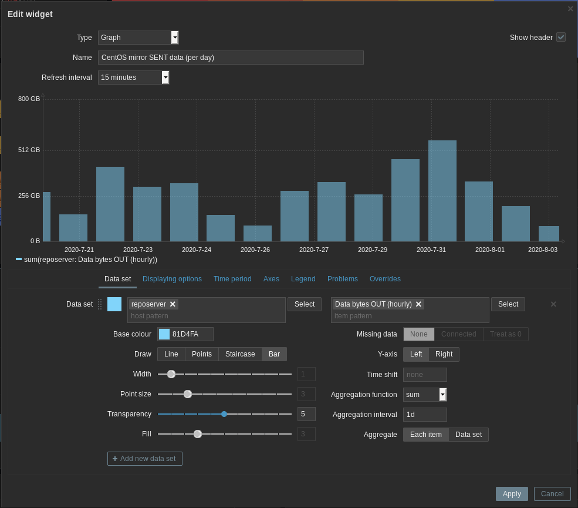

## Reposerver setup and configuration repository

This repository contains tools and config files for 
full reposerver deployment on CentOS 7.7 minimal OS.

Organization:
~~~
├── README.md
...
├── deploy.yml    # main deploy playbook
├── roles         # ansible roles for configuring server
│   ├── ansible.osc-zabbix-agent   # monitoring
│   ├── reposerver_base_os         # basic OS configuration, public mirror configuration and webserver
│   │   └── files/www-public
│   ├── reposerver_tls             # lentencrypt certificate configuration
│   └── reposerver_project-centos  # CentOS sync project
│       └── files/www-fake
...
├── project-centos  # CentOS project
│   ├── README.md                             # CentOS project README
│   ├── deploy_project-centos.yml             # deployment playbook for CentOS project
│   ├── roles                                 # directory with roles for this project
│   └── zabbix_tmpl_CentOS_mirror_checks.xml  # monitoring template for Zabbix
...
~~~

### Monitoring of reposerver
- CentOS main mirror sync status - [CentOS mirror-status](https://mirror-status.centos.org/#kr)
- Zabbix monitoring
  - host 'reposerver'
  - dashboard widget for daily transfered data

- log files
  - mirroring scripts - `/var/log/cron_project-centos.log`
  - SSL auto-renewal script - `/var/log/getssl.log`
- used disk space
  - on mirror filesystem `/data`
  - on VDO device `vdostats --human-readable`
~~~
# lsblk
...
sdb                8:16   0 372.5G  0 disk
└─vdo_data       253:2    0   500G  0 vdo  /data
# df -h |grep data
/dev/mapper/vdo_data      500G  397G  104G  80% /data
# vdostats --human-readable
Device                    Size      Used Available Use% Space saving%
/dev/mapper/vdo_data    372.5G    283.2G     89.3G  76%           30%
~~~

### Manual sync of CentOS repository
Use modified command from `/etc/cron.reposerver.d/project-centos/01_sync_script.sh`.
~~~
# flock -n -E 2 /data/centos -c 'timeout 4h rsync -avzH4 --progress --delay-updates --delete msync.centos.org::CentOS /data/centos/'
~~~

### Base OS configuration deployment steps:
- download this repository as ZIP archive
- on minimal CentOS 7.x server install `unzip` package and copy the ZIP archive to server
  ~~~
  $ scp 'reposerver-master@xxxxxxxxxxx.zip' root@reposerver:
  # yum install unzip
  ~~~
- extract the ZIP archive into `/reposerver` directory
  ~~~
  # mkdir /reposerver
  # unzip reposerver-master\@7119315f759.zip -d /reposerver
  ~~~
- adjust the `vdo_disk` and `vdo_disk_size` in `/reposerver/deploy.yml` if needed:
  - `vdo_disk` - path to disk that will be used for storing repository data
  - `vdo_disk_size` - virtual size of `vdo_disk`, this can be larger than physical size because data are automatically de-duplicated
- enable EPEL and install `ansible`
  ~~~
  # yum install epel-release
  # yum install ansible
  ~~~
- apply `deploy.yml` playbook from the `/reposerver` directory to run basic configuration of reposerver
  ~~~
  # cd /reposerver
  # ansible-playbook deploy.yml
  ~~~
- REBOOT
  ~~~
  # reboot
  ~~~
- check the state of server and services:
  - run the `deploy.yml` playbook with `--check` option and check that there are NO 'changed' tasks. **NOTE:** When running this check after server was running for some time, then it is expected that few 'changed' tasks will appear.
  ~~~
  # cd /reposerver
  # ansible-playbook deploy.yml --check
  ...
  PLAY RECAP ******************************************************************
  localhost: ok=46 changed=0 unreachable=0 failed=0 skipped=2 rescued=0 ignored=0
  ~~~
  - VDO disk is mounted on `/data/`
  ~~~
  # df -h |grep data
  /dev/mapper/vdo_data      500G   33M  500G   1% /data
  ~~~

  - HTTP server default site check
  ~~~
  # curl http://127.0.0.1/
  This is default server page that should redirect in future to public mirro page.
  ~~~
  - HTTP server public site check
  ~~~
  # curl -H 'Host: mirror.opensourcelab.co.kr' http://127.0.0.1/
  <html>
  <head><title>OpenSource Consulting Public Mirror Site</title></head>
  <body>
  
  ...
  ~~~
  - RSYNC server check
  ~~~
  # rsync 127.0.0.1::
  ===============================================================
  Welcome on OpenSource Consulting (OSC) public mirror rsync server
  ...
  ~~~

### TLS certificate renewal
This process is automated and every 'Monday at 7:30 am' cron will run `getssl -a` to renew any certificates that needs update. Logs are stored at `/var/log/getssl.log`
